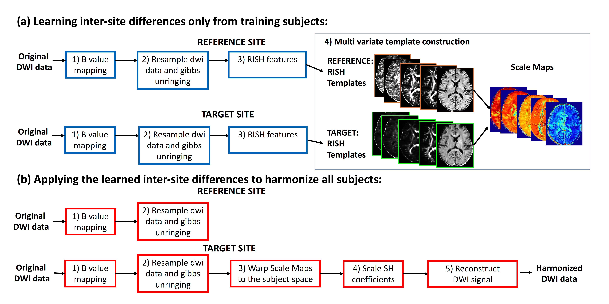

  

*dMRIharmonization* repository is developed by Tashrif Billah, Sylvain Bouix, Suheyla Cetin Karayumak, and Yogesh Rathi, Brigham and Women's Hospital (Harvard Medical School).

# Multi-site dMRI harmonization

Integrated study of multi-site diffusion MRI (dMRI) data can enable diagnosis, monitoring, and treatment of 
several brain diseases. However, data acquired on a variety of scanners cannot be integrated due to 
differences in acquisition parameters and scanner artifacts. Therefore, dMRI data has to be harmonized for 
joint analysis by removing scanner-specific differences. 
 
*dMRIharmonization* is a Python command line module that implements a method capable of removing scanner-specific effects. 
The proposed method eliminates inter-site variability in acquisition parameters, 
while preserves inter-subject anatomical variability. 

See  for more details

The method leverages on rotation invariant spherical harmonics (RISH) features derived from spherical harmonic coefficients. 
In brief, the method constructs a scale map for each pair of reference and target sites. Applying the scale map to the 
target site, it aims to remove inter-site variability. 

# Citation

If this repository is useful in your research, please cite as below: 

Tashrif Billah, Sylvain Bouix, Suheyla Cetin Karayumak, and Yogesh Rathi *Multi-site Diffusion MRI Harmonization*, 
https://github.com/pnlbwh/dMRIharmoniziation, 2018, DOI: 10.5281/zenodo.2584271

# Dependencies

* ANTs
* FSL
* reisert/unring
* numpy
* scipy
* scikit-image
* dipy
* nibabel
* pynrrd

# Installation

## 1. Install prerequisites

Python 3, and FSL (ignore the one(s) you have already):

### Check system architecture

    uname -a # check if 32 or 64 bit

### Python 3

Download [Miniconda Python 3.6 bash installer](https://conda.io/miniconda.html) (32/64-bit based on your environment):
    
    sh Miniconda3-latest-Linux-x86_64.sh -b # -b flag is for license agreement

Activate the conda environment:

    source ~/miniconda3/bin/activate # should introduce '(base)' in front of each line

### FSL

Follow the [instruction](https://fsl.fmrib.ox.ac.uk/fsl/fslwiki/FslInstallation) to download and install FSL.

### unringing

    git clone https://bitbucket.org/reisert/unring.git
    cd unring/fsl
    export PATH=$PATH:`pwd`
    unring --help

## 2. Install pipeline

Now that you have installed the prerequisite software, you are ready to install the pipeline:

    git clone https://github.com/pnlbwh/dMRIharmonization.git && cd dMRIharmonization
    conda create -f environmnet.yml     # you may comment out any existing package from environment.yml
    conda activate harmonization        # should introduce '(harmonization)' in front of each line

### 3. Configure your environment

Make sure the following executables are in your path:

    antsMultivariateTemplateConstruction2.sh
    antsApplyTransforms
    antsRegistrationSyNQuick.sh
    dtifit
    unring.a64
    
You can check them as follows:

    which dtifit
    
If any of them does not exist, add that to your path:

    export PATH=$PATH:/directory/of/executable
    
`conda` should already put the ANTs scripts in your path. However, if you choose to use pre-installed ANTs scripts, 
you may need to define [ANTSPATH`](https://github.com/ANTsX/ANTs/wiki/Compiling-ANTs-on-Linux-and-Mac-OS#set-path-and-antspath)

# Running

Upon successful installation, you should be able to see the help message

`$ lib/harmonization.py --help`

    Template creation, harmonization, and debugging
    
    Usage:
        harmonization.py [SWITCHES] 
    
    Meta-switches:
        -h, --help                          Prints this help message and quits
        --help-all                          Prints help messages of all sub-commands and quits
        -v, --version                       Prints the program's version and quits
    
    Switches:
        --bvalMap VALUE:str                 specify a bmax to scale bvalues into
        --create                            turn on this flag to create template
        --debug                             turn on this flag to debug harmonized data (valid only with --process)
        --denoise                           turn on this flag to denoise voxel data
        --force                             turn on this flag to overwrite existing data
        --harm_list VALUE:ExistingFile      harmonized csv/txt file with first column for dwi and 2nd column for mask: dwi1,mask1
                                            dwi2,mask2 ...
        --nproc VALUE:str                   number of processes/threads to use (-1 for all available, may slow down your system);
                                            the default is 8
        --nshm VALUE:str                    spherical harmonic order; the default is 6
        --process                           turn on this flag to harmonize
        --ref_list VALUE:ExistingFile       reference csv/txt file with first column for dwi and 2nd column for mask: dwi1,mask1
                                            dwi2,mask2 ...
        --ref_name VALUE:str                reference site name; required
        --resample VALUE:str                voxel size MxNxO to resample into
        --tar_list VALUE:ExistingFile       target csv/txt file with first column for dwi and 2nd column for mask: dwi1,mask1
                                            dwi2,mask2 ...; required
        --tar_name VALUE:str                target site name; required
        --template VALUE:str                template directory; required
        --travelHeads                       travelling heads

The `harmonization.py` cli takes in the following arguments that are explained below.

* --bvalMap VALUE:str
* --create
* --debug
* --denoise
* --force
* --harm_list VALUE:ExistingFile
* --nproc VALUE:str
* --nshm VALUE:str
* --process
* --ref_list VALUE:ExistingFile
* --ref_name VALUE:str
* --resample VALUE:str
* --tar_list VALUE:ExistingFile
* --tar_name VALUE:str
* --template VALUE:str
* --travelHeads

# Tests

A small test data is provided with each [release](https://github.com/pnlbwh/Harmonization-Python/releases). You may 
run test as follows:
    
    cd lib/tests
    ./test_pipeline.sh
    
NOTE: running the tests might take a while.

`./pipeline_test.sh` will download test data, and run the whole processing pipeline on them. 
If the test is successful and complete, you should see the following output on the command line. 
    
    Printing statistics :
    CONNECTOM mean FA:  0.5217237675408243
    PRISMA mean FA before harmonization:  0.5072286796848892
    PRISMA mean FA after harmonization:  0.5221998242139347

Also, you may run 
unittest as follows:
    
    python -m unittest discover -v lib/tests/    
    

# List of images

Two image lists (.txt or .csv) are required for the reference and target sites:

    --ref_list cidar_imgs_masks.csv
    --tar_list mrc_imgs_masks.txt
    
Each `\n` delimited line in the list file should have `,` seperated dwi and mask:
 
    case001_dwi.nii.gz,case001_mask.nii.gz
    case002_dwi.nrrd,case002_mask.nii.gz
    case003_dwi.nii,case003_mask.nhdr
    ...
    ...

# Site names

Site names are used to properly identify files in the template:
    
     --ref_name CIDAR
     --tar_name MRC
     

# Multi threading

Processing can be multi-threaded over the cases. Besides, `antsMultivariateTemplateConstruction2.sh` utilizes 
multiple threads to speed-up template construction. 

    --nproc 8 # default is 4, use -1 for all available
   
However, multi-threading comes with a price of slowing down other processes that may be running in your system. So, it 
is advisable to leave out at least two cores for other processes to run smoothly.

# Order of spherical harmonics

RISH features are derived from spherical harmonic coefficients. The order of spherical harmonic coefficients you can use 
is limited by the lowest number of gradients present in the diffusion images between reference and target sites. 

| `--nshm` | # of shm coefficients | Required # gradients >= |
|----------|-----------------------|-------------------------|
|    0     |            1          |           1             |
|    2     |            6          |           6             |
|    4     |            15         |           15            |
|    6     |            28         |           28            |
|    8     |            45         |           45            |

# NRRD support

The pipeline is written for NIFTI image format. However, NRRD support is incorporated through [NIFTI --> NRRD](https://github.com/pnlbwh/Harmonization-Python/blob/parallel/lib/preprocess.py#L78) 
conversion on the fly.

See Tashrif Billah, Isaiah Norton, Ryan Eckbo, and Sylvain Bouix, Processing pipeline for anatomical and diffusion weighted images, 
https://github.com/pnlbwh/pnlpipe, 2018, DOI: 10.5281/zenodo.2584271 for more details on the conversion method.

# Preprocessing

There are three preprocessing steps. More than one step can be specified at a time. However, they are performed in 
the following order.

### 1. Denoising
    
    --denoise        # turn on this flag to denoise voxel data

### 2. Bvalue mapping

    --bvalMap VALUE  # specify a bmax to scale bvalues into    

### 3. Resampling

    --resample VALUE # voxel size MxNxO to resample into

After preprocessing, the image lists are saved with `.modified` extension in the same location of provided lists, 
and used for further processing.
 
# Config   
    
    pass

# Template
    pass
    
# List of outputs
    pass
    
## Folders

In each input image directory, two folders are created: `dti` and `rish`. The `dti` folder stores diffusion measures 
and corresponding transform files. On the other hand `rish` folder stores RISH features and corresponding transform files.

## Files
    
    pass

      
# Template creation

    python -m pdb \
    /home/tb571/Downloads/Harmonization-Python/lib/harmonization.py \
    --reference /home/tb571/Downloads/Harmonization-Python/test_data/ref_caselist.txt \
    --target /home/tb571/Downloads/Harmonization-Python/test_data/target_caselist.txt \
    --template /home/tb571/Downloads/Harmonization-Python/test_data/template/ \
    --travelHeads \
    --force \
    --N_shm 6 \
    --create

# Data harmonization

    python -m pdb \
    /home/tb571/Downloads/Harmonization-Python/lib/harmonization.py \
    --N_shm 6 \
    --denoise \
    --force \
    --process \
    --target /home/tb571/Downloads/Harmonization-Python/test_data/target_caselist.txt \
    --template /home/tb571/Downloads/Harmonization-Python/test_data/template/ \
    --travelHeads

# Debugging

dMRIharmonization toolbox is provided with a debugging capability to test how good has been the 
harmonization. `--debug` can be run with any (or all) of `--create` and `--process` options or separately. 

Once harmonization is done, there are three types of data:

* reference site 
* target site
* harmonized target

If the three data sets are brought into a common space, then looking at the mean FA over the whole brain, 
we can comment on the goodness of harmonization. If data is properly harmonized, then mean FA of the harmonized target 
should be almost equal to the mean FA of that of reference site.

In details:

* reference data is proprocessed, and registered to reference template space and then to MNI space ([IITmean_FA.nii.gz](http://www.iit.edu/~mri/IITHumanBrainAtlas.html))
* unprocessed target data is directly registered to MNI space
* harmonized target data is registered to target template space and then to MNI space
* once the data are in MNI space, we calculate mean FA over the [IITmean_FA_skeleton.nii.gz](http://www.iit.edu/~mri/IITHumanBrainAtlas.html) 
 

The numbers should like like below:

    Printing statistics :
    CIDAR mean FA:  0.5217237675408243
    BSNIP mean FA before harmonization:  0.5072286796848892
    BSNIP mean FA after harmonization:  0.5321998242139347

As we see above, BSNIP (target) mean FA over [IITmean_FA_skeleton.nii.gz](http://www.iit.edu/~mri/IITHumanBrainAtlas.html) 
for all the site images after harmonization increased to be almost equal to that of CIDAR (reference) mean FA.

Now there are two ways to debug:

### 1. With the pipeline 
Use `--debug` flag with any (or all) of `--create` and `--process`

### 2. Use seperately 
If you would like to debug at a later time, you need to specify three images lists:

* `--ref_list`: use the reference list with `.modified` extension
* `--tar_list`: use the unprocessed target list **without** the `.modified` extension
* `--harm_list`: use the harmonized target list with `.harmonized` extension

    lib/harmonization.py --ref_list ref.txt.modified --tar_list target.csv --harm_list target.csv.modified.harmonized

NOTE: You should run the pipeline first before debugging separately because `--debug` makes use of files created 
in the pipeline. 

# Caveats

`antsMultivariateTemplateConstruction2.sh`: all the images need to have unique
prefix because transform files are created in the same `--template ./template/` directory. The value of `--template` 
should have `/` at the end. The pipeline appends one if there is not, but it is good to include it when specifying.

# Reference

Karayumak, S.C., Bouix, S., Ning, L., James, A., Crow, T., Shenton, M., Kubicki, M. and Rathi, Y., 2019. 
Retrospective harmonization of multi-site diffusion MRI data acquired with different acquisition parameters. 
Neuroimage, 184, pp.180-200.